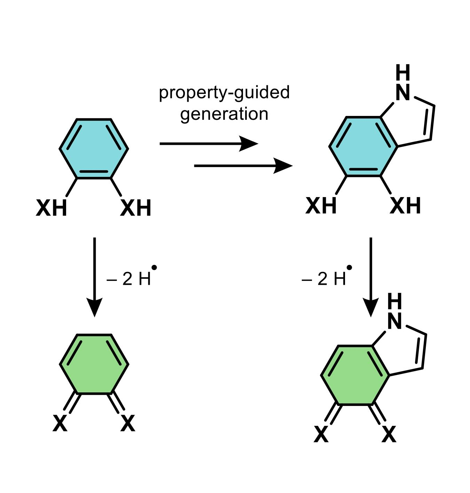

# Effective Quest into Bounded Chemical Space (EQUUS)

This is a project focusing on rapid virtual screening of aromatic 1,2-diamines as candidates for Proton-Coupled Electron Transfer processes. More specifically, the goal is to tune the average bond dissociation free energy (BDFE) of the N-H bonds. This repository includes the code we used to generate diamines/diimines so it is quite rdkit-heavy.

    

Data, code for regression and generation will be made public soon.
